<p align="center">
  
</p>

<p align="center">
  <a href="#-hızlı-başlangıç"><b>Hızlı başlangıç</b></a>
  &nbsp;·&nbsp;
  <a href="#-kurulum"><b>Kurulum</b></a>
  &nbsp;·&nbsp;
  <a href="#-ne-üretir"><b>Ne üretir?</b></a>
  &nbsp;·&nbsp;
  <a href="#-kitabını-yaz-kitaptikte-yayımla"><b>Kitaptik'te yayımla</b></a>
  &nbsp;·&nbsp;
  <a href="#-beceriler"><b>Beceriler</b></a>
  &nbsp;·&nbsp;
  <a href="docs/OZELLIK-KARSILASTIRMA.md"><b>Karşılaştırma</b></a>
  &nbsp;·&nbsp;
  <a href="#-sık-sorulanlar"><b>SSS</b></a>
  &nbsp;·&nbsp;
  <a href="CHANGELOG.md"><b>Değişiklikler</b></a>
</p>

<p align="center">
  <a href="https://github.com/cumabozkurt/ai-hikaye-roman-olusturma/actions/workflows/test.yml"></a>
  <a href="https://github.com/cumabozkurt/ai-hikaye-roman-olusturma/releases/latest"></a>
  
  
  
  <a href="LICENSE"></a>
  
  <a href="https://github.com/cumabozkurt/ai-hikaye-roman-olusturma/stargazers"></a>
</p>

<p align="center">
  <a href="https://kitaptik.com"></a>
  <a href="https://github.com/cumabozkurt/ai-hikaye-roman-olusturma/discussions"></a>
</p>

<h3 align="center">Romanınızı planlayan, hatırlayan, denetleyen ve Kitaptik'te okurla buluşturan Türkçe yazım atölyesi.</h3>

<p align="center">Kar tanesinden sahne kartına, kurgu ansiklopedisinden ipucu defterine, yazar onaylı revizyon döngüsünden EPUB, DOCX, PDF'e ve <a href="https://kitaptik.com">Kitaptik</a>'teki okura kadar<br>bir romanın bütün yolu, kullandığınız yapay zekâ ajanının içinde ve kendi dosyalarınızda.</p>

**AI Hikaye & Roman Oluşturma**, Claude Code, OpenAI Codex, OpenCode ve SKILL.md okuyabilen her kodlama ajanının içine kurulan **Türkçe bir yazım atölyesidir**. 25 beceri, 8 uzman ajan ve yalnızca Python standart kitaplığıyla çalışan belirlenimci denetçiler; planlamayı, uzun roman belleğini, sürekliliği, TDK yazımını, yapay zekâ tadı gidermeyi, sürümleri, yazım istatistiklerini, yayın dosyalarını ve Kitaptik'te yayımlamayı tek bir iş akışında toplar. Kitabınız sohbet hafızasında değil, dosyalarınızda yaşar; ek model, GPU, bulut hesabı ya da kurulacak kitaplık gerekmez.

> **2.1'de yeni:** [Kitaptik'te yayımla](#-kitabını-yaz-kitaptikte-yayımla). `/kitaptik-yayimla` bitmiş romanınızı Türkçe okuma platformu [kitaptik.com](https://kitaptik.com)'un yazar ekranına hazırlar: kategori ve etiket önerisi, sınır ve içerik denetimi, toplu yüklemeye hazır DOCX, kitap bilgileri, karakter kartları ve kontrol listesi.
>
> **2.0'da yeni:** yapı yöntemleri ve kar tanesi, sahne kartları ve mantar pano, kurgu ansiklopedisi ve tutarlılık denetimi, ipucu defteri, katmanlı özetlerle uzun roman belleği, yazar onaylı yaz → eleştir → düzelt döngüsü, bölüm turnuvası, ses izi, anlık görüntü ve fark, yazım panosu, DOCX/ODT/baskı PDF'i, DOCX/ODT/EPUB içe aktarma, Osmanlı ve erken Cumhuriyet tür kartlarıyla dönem denetimi ve sekmeli çalışma masası. Ayrıntı: [CHANGELOG](CHANGELOG.md).

## 💡 Neden bu proje?

- **Türkçe için baştan tasarlandı.** Türkçe yapay zekâ klişeleri, TDK yazım kuralları, Türkçe ek budamalı arama, "Birinci Bölüm" ya da "BÖLÜM BİR" başlıklarını tanıyan içe aktarma, Türkçe binlik ve tarih yazımı, Türkiye yayın pazarı. Çeviri bir arayüz değil.
- **Uzun romanda hafıza kaybolmaz.** Karakter, mekân, nesne, zaman çizelgesi ve sözlük dosyalarda; her bölüm için yalnızca o bölümde gereken bilgiyi toplayan bağlam paketi ve kitap → cilt → bölüm özet katmanları var. 100. bölümde de ölü karakter konuşmaz, ekilen ipucu unutulmaz.
- **Yapay zekâ yazar, karar sizde.** Revizyon döngüsü her turu ölçülebilir puanla kaydeder, plato ve hedefte durur; bölüm dosyasına yazmak için açık yazar onayı ister ve önceki hâli her zaman anlık görüntüye alır.
- **Ölçen, tahmin etmeyen denetçiler.** Plan konumu, ipucu vadesi, ad kayması, göz rengi çelişkisi, dönem uyumsuzluğu, okunabilirlik: hepsi satır numarasıyla, aynı girdide her seferinde aynı sonucu veren betiklerle.
- **Tek araç, bütün yol.** Planlamadan yayın dosyasına ve Kitaptik'teki okura kadar başka programa geçmeniz gerekmez; Word, LibreOffice ya da EPUB'daki eski taslağınızı da bölümlere bölerek içeri alır.
- **Güvenilir.** Her gönderimde Ubuntu (Python 3.11–3.14), macOS ve Windows üzerinde testler, EPUBCheck ve LibreOffice doğrulamaları, bozuk girdi denemeleri. Kod MIT lisanslı ve bağımlılıksız.

## ✨ Öne çıkanlar

| | | |
|---|---|---|
| **🧭 Planlama**<br>Üç perde, kahramanın yolculuğu, serim-düğüm-çözüm, yedi nokta ve kar tanesi; vuruşun doğru bölüme düşüp düşmediğini ölçen denetim; sahne kartları ve mantar pano. | **📖 Kurgu ansiklopedisi**<br>Karakter (mülakatıyla), mekân, nesne, grup, zaman çizelgesi, ilişki ve sözlük; kayıt–metin tutarlılığı, bölümlere dağılım ısı haritası, ilişki grafiği. | **🧵 100+ bölüm süreklilik**<br>Yazar gerçeği / okur bilgisi ayrımı, ipucu defteri (vade, son anılma, yığılma), katmanlı özetler, kayıttan sonra değişen bölüm uyarısı. |
| **🔁 Yazar onaylı döngü**<br>Yaz → eleştir → düzelt turları; mekanik puan + `bolum-hakemi` ajanı, plato tespiti, revizyon talimatı, Elo bölüm turnuvası, ses izi karşılaştırması. | **🇹🇷 Türkçe denetçiler**<br>TDK yazımı, Türkçe yapay zekâ kalıpları, Ateşman okunabilirliği, cümle ritmi, yakın tekrar; Osmanlı ve erken Cumhuriyet için dönem uyumsuzluğu denetimi. | **📊 Yazım panosu ve sürümler**<br>Kitap ve günlük hedef, seri, bitiş tahmini; anlık görüntü, kelime düzeyinde fark, güvenli geri yükleme; sekmeli yerel çalışma masası. |
| **📦 Yayına hazır çıktı**<br>EPUB 3 (EPUBCheck hatasız), DOCX ve ODT (LibreOffice ile doğrulanır), A5 baskı HTML'i ve PDF, TXT, Markdown; yayınevi paketi, seslendirme metni; Kitaptik toplu yükleme paketi. | **📥 İçe aktarma**<br>DOCX, ODT, EPUB, TXT ve Markdown taslakları Türkçe bölüm başlıklarını tanıyarak böler; kelime sayısı %1'den fazla tutmazsa hiçbir şey yazmaz. | **🔒 Yerel ve bağımlılıksız**<br>Planlama, denetim ve derleme betikleri ağa çıkmaz (yalnızca pazar taraması, siz istediğinizde herkese açık sayfaları okur). Yalnızca Python standart kitaplığı; çalışma masası yalnızca `127.0.0.1` üzerinden açılır. |

> **Wattpad notu:** Wattpad, Türkiye'de 12 Temmuz 2024'ten beri mahkeme kararıyla erişime kapalıdır (Eylül 2026 itibarıyla engel sürüyor). `wattpad-bolum-planla` ve `roman-tara` bu durumu bilir; ölçüler bütün bölümlü yayın platformlarında geçerlidir ve paket erişim engelini aşma yöntemi önermez. Türkiye'den bölüm bölüm yayımlamak için: [Kitaptik](#-kitabını-yaz-kitaptikte-yayımla).

## 📣 Kitabını yaz, Kitaptik'te yayımla

Bir romanı bitirmek yolun yarısı; öbür yarısı okur. **[Kitaptik](https://kitaptik.com)**, Türkiye'den erişilebilen, Türkçe kitap yazma ve okuma platformudur: web sitesi, iOS ve Android uygulaması var, üyelik ücretsiz, kitap ve bölüm eklemek için onay beklemezsiniz. Bu paket yazdığınız kitabı oraya götüren son adımı da yapar:

```text
Kitabımı Kitaptik'te yayımlamak istiyorum.
```

`/kitaptik-yayimla` şunları hazırlar, **size yalnızca yüklemek kalır**:

- **Kitap bilgileri:** Kitaptik'in 10 ana kategorisinden doğru olan ve en çok 3 alt kategori, isabetli etiketler, 2.500 karakterlik açıklama ve 333 karakterlik "Neden okumalı?" metni (ajanla birlikte yazılır, onayınız olmadan yazılmaz).
- **Toplu yükleme DOCX'i:** her bölüm bir Başlık 1; 10.000 kelimeyi aşan bölümler sahne ayracında bölünür, 77 karakteri aşan başlıklar kısaltılır. **Bölümler → Toplu Yükle** ekranına doğrudan verilir.
- **Denetim:** kapak biçimi ve ölçüsü, bitmemiş metin, bölüm içi bağlantılar, Topluluk Kuralları'na göre 18+ işareti ve `[TW: İntihar]` uyarısı gerekebilecek yerler.
- **Karakter kartları ve kontrol listesi:** spoiler vermeyen karakter tanıtımları; üyelikten **Yayınla** düğmesine kadar adım adım liste.

<p align="center">
  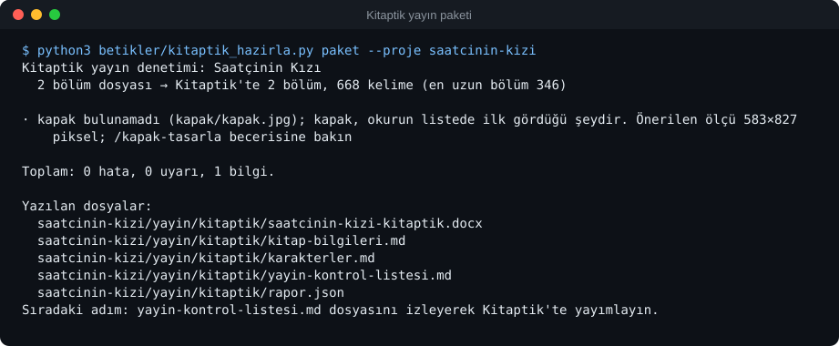
</p>

Kitaptik'te sizi bekleyenler (25 Eylül 2026'da doğrulandı): okunma, beğeni, yorum ve kütüphane sayılarını gösteren kitap istatistikleri; kategori ve "yükselen yıldızlar" gibi liste sıralamaları; paragraf paragraf okur yorumları; takipçilere yeni bölüm bildirimi; okur için ücretsiz çevrim içi okuma, PDF indirme, uygulamada çevrim dışı ve sesli okuma. İçeriğin sahipliği sizde kalır; Kitaptik, hikâyeleri üçüncü tarafların üretken yapay zekâ eğitimi için satmayacağını taahhüt eder. Aktif Premium üyelikle okur aboneliği, destek ve ücretli kitaptan yazar payı %40'tır ([koşullar](https://kitaptik.com/nasil-para-kazanilir)).

Burada okunma ya da kazanç vaadi yok: okuru kitabınız ve düzenli yayınınız kazanır. Beceri **siteye giriş yapmaz, dosya yüklemez**; yükleme ve **Yayınla** düğmesi sizindir. Rehber, sınırlar ve kurallar: **[docs/KITAPTIK-ILE-YAYIMLAMA.md](docs/KITAPTIK-ILE-YAYIMLAMA.md)**.

## 🚀 Hızlı başlangıç

**1. Kurun** (Claude Code örneği; diğer ajanlar için [Kurulum](#-kurulum)):

```text
/plugin marketplace add cumabozkurt/ai-hikaye-roman-olusturma
/plugin install ai-hikaye-roman-olusturma@ai-hikaye-roman-olusturma
```

**2. Yazım klasörünüzü hazırlayın.** Boş bir klasörde ajanı açın ve şunu yazın, sonra **yeni bir oturum** başlatın:

```text
/hikaye-kurulum
```

**3. İlk isteğinizi yazın:**

```text
Kuzguncuk'ta geçen, amatör dedektifli bir polisiye roman başlatmak istiyorum.
Önce yapıyı tartışalım: okur sözleşmesi, ana merak sorusu, ilk üç bölümde ne değişecek. Metin yazma.
```

Gerisini `hikaye` yönlendiricisi halleder: yapı tartışması → genel plan → bölüm planı → yazım → denetim → takip kaydı → Kitaptik'te yayın.

## 📥 Kurulum

Python 3.11 ya da üstü gerekir (denetim betikleri ve kancalar yalnızca standart kütüphaneyi kullanır).

<details open>
<summary><b>Claude Code</b> (eklenti pazar yeri)</summary>

Claude Code içinde:

```text
/plugin marketplace add cumabozkurt/ai-hikaye-roman-olusturma
/plugin install ai-hikaye-roman-olusturma@ai-hikaye-roman-olusturma
```

ya da terminalden:

```bash
claude plugin marketplace add cumabozkurt/ai-hikaye-roman-olusturma
claude plugin install ai-hikaye-roman-olusturma@ai-hikaye-roman-olusturma
```

Eklentiyle kurulan beceriler ad alanıyla da çağrılabilir: `/ai-hikaye-roman-olusturma:roman-yaz`. Güncellemek için `claude plugin marketplace update ai-hikaye-roman-olusturma`.
</details>

<details>
<summary><b>OpenAI Codex</b></summary>

```bash
codex plugin marketplace add cumabozkurt/ai-hikaye-roman-olusturma
codex plugin add ai-hikaye-roman-olusturma@ai-hikaye-roman-olusturma
```

İkinci komut yerine Codex içindeki `/plugins` menüsünü de kullanabilirsiniz. Beceriler `$roman-yaz` ya da `/skills` ile çağrılır. Depoyu klonladıysanız `.agents/skills` bağlantısı sayesinde beceriler kendiliğinden bulunur.
</details>

<details>
<summary><b>Her ajan için tek komut</b> (npx skills)</summary>

```bash
npx skills add cumabozkurt/ai-hikaye-roman-olusturma -g -a claude-code codex opencode -y
```

`-g` kullanıcı düzeyinde kurar; yalnızca bulunduğunuz klasöre kurmak için kaldırın. `-a` ile ajanları seçin; `-a` vermezseniz araç bulduğu bütün ajanlara kurmayı dener ve genel kurulumu desteklemeyen ajanlar için zararsız "desteklemiyor" satırları yazar. Güncellemek için komutu yeniden çalıştırın.
</details>

<details>
<summary><b>OpenCode, Antigravity, ZCode, OpenClaw, Reasonix ve diğerleri</b></summary>

```bash
git clone https://github.com/cumabozkurt/ai-hikaye-roman-olusturma.git
cd ai-hikaye-roman-olusturma
bash betikler/kur.sh            # Claude Code, Codex ve OpenCode kullanıcı klasörlerine kopyalar
# Windows: powershell -ExecutionPolicy Bypass -File betikler\kur.ps1
```

ZCode için depo kökündeki `marketplace.json`, Reasonix için `reasonix-plugin.json` kullanılabilir.
</details>

**Kurulumu doğrulayın:** Claude Code'da `claude plugin details ai-hikaye-roman-olusturma@ai-hikaye-roman-olusturma`, OpenCode'da `opencode debug skill` 25 beceriyi listelemelidir. Sorun giderme ve ev sahibine göre ayrıntılar: [docs/ev-sahipleri.md](docs/ev-sahipleri.md).

**Yazım projesine kurulum (her proje için bir kez):** proje kökünde `/hikaye-kurulum` (Codex'te `$hikaye-kurulum`). Ajanları, kancaları, proje kurallarını ve ortak kaynakları güvenle kurar; kendi `CLAUDE.md`/`AGENTS.md` içeriğiniz korunur. Kurulumdan ve her sürüm yükseltmesinden sonra yeni bir oturum açın. Codex kancaları ilk kullanımda `/hooks` ile güven onayı ister.

## 👀 Ne üretir?

Aşağıdaki çıktıların hepsi depodaki örnek romandan (*Saatçinin Kızı*) **gerçek komutlarla** üretildi. Terminal görselleri `python3 betikler/terminal_gorseli.py` ile yeniden üretilebilir; çalışma masası görüntüleri, örnek projede birkaç günlük yazım, iki anlık görüntü ve iki revizyon turu kaydedildikten sonra alındı.

### Çalışma masası: kitabın tamamı tek bakışta

`/hikaye` içinden ya da `python3 betikler/calisma_masasi.py --calisma-alani .` ile açılan yerel, salt okunur panel. Sekmeler: Genel, Kurgu, Sahneler, İpuçları, Döngü, Sürümler (`#sekme=sahneler` gibi bağlantılar yer imine eklenebilir).

<p align="center">
  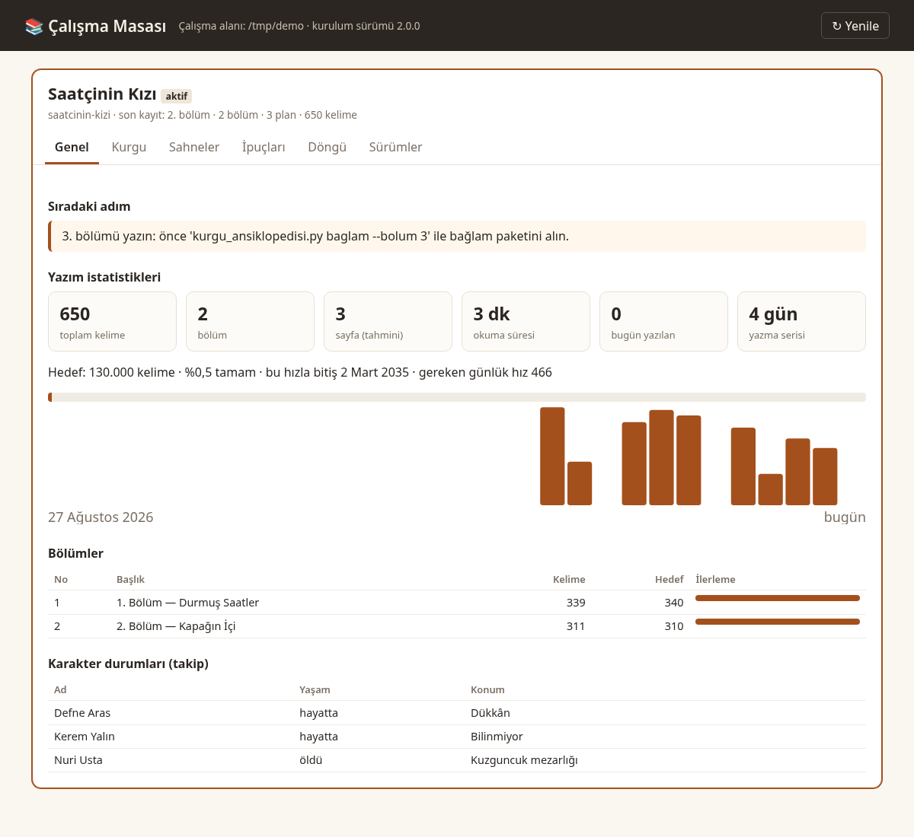
</p>

<table>
<tr>
<td width="50%">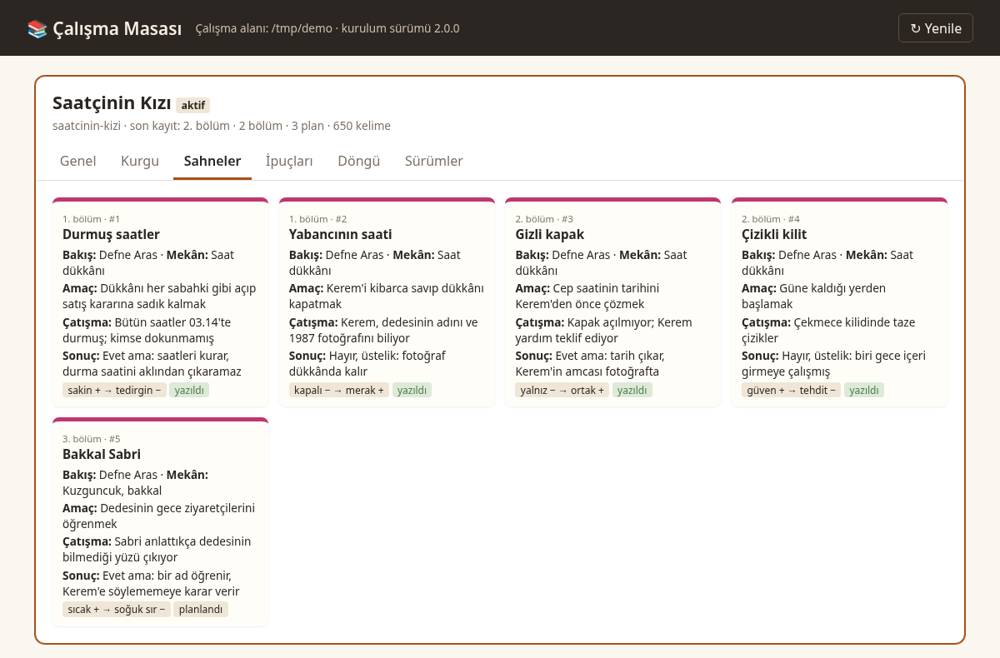</td>
<td width="50%">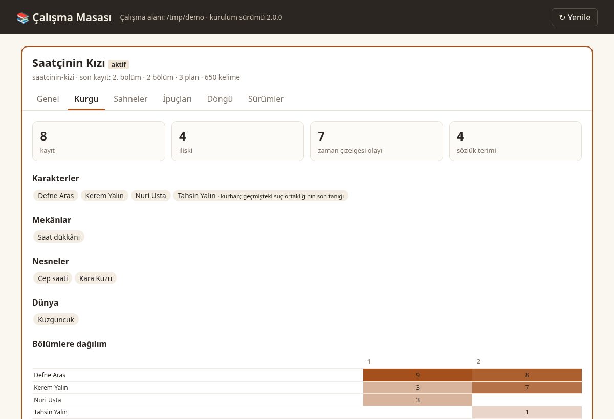</td>
</tr>
<tr>
<td>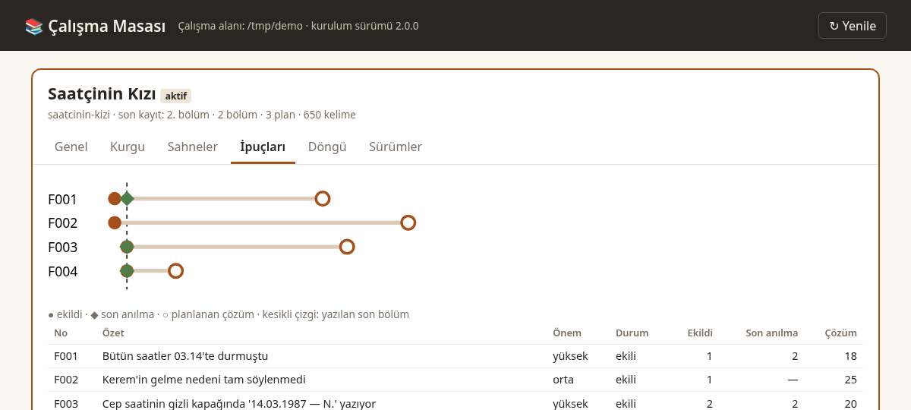</td>
<td>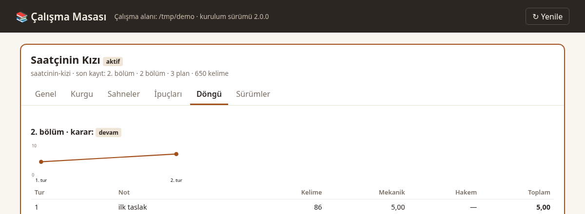</td>
</tr>
</table>

Döngü sekmesindeki iki tur gerçektir: yapay zekâ tadı taşıyan taslak (`once.md`) 5,00, aynı sahnenin düzeltilmiş hâli (`sonra.md`) 7,50 mekanik puan aldı.

### İpucu defteri ve kurgu ansiklopedisi

<p align="center">
  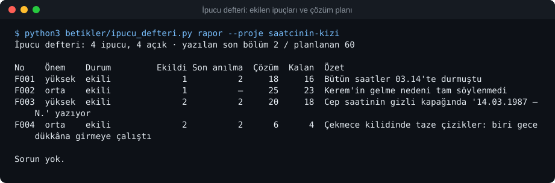
</p>

<p align="center">
  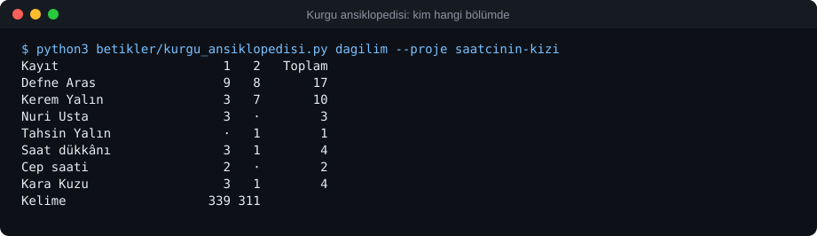
</p>

### Yapay zekâ tadı: önce ve sonra

<table>
<tr><th width="50%">Önce: yapay zekâ tadı taşıyan sahne</th><th width="50%">Sonra: aynı sahne, eylem ve nesneyle</th></tr>
<tr><td valign="top">

> Defne derin bir nefes aldı. Kalbi hızla çarpıyordu ve içini bir ürperti kapladı.
>
> Bu sadece bir saat değildi, geçmişin kilitli bir kapısıydı. Bir yandan korkuyordu, diğer yandan merak onu kemiriyordu.
>
> Korku yoktu. Tereddüt yoktu. Geri dönüş yoktu.
>
> Kerem'in sesi alçaktı ama odadaki herkesi susturdu. Zaman durmuş gibiydi; sessizlik odayı doldurdu ve kelimelerle anlatılamaz bir gerilim havada asılı kaldı.
>
> Defne adeta büyülenmiş gibi, sanki bir rüyadaymış gibi kapağı açtı. Kaderin çarkları dönmeye başlamıştı.
>
> Ve o an anladı ki hiçbir şey eskisi gibi olmayacaktı. Bu, bir yolculuğun başlangıcıydı.

</td><td valign="top">

> Defne saati tezgâha bıraktı, parmaklarını önlüğüne sildi.
>
> Arka kapağın kenarında tırnak ucu kadar bir çentik vardı. Dedesi bu saati ona on iki yaşındayken bir kez göstermiş, sonra hiç sözünü etmemişti. Tornavidayı çentiğe yerleştirdi, eli bir an durdu.
>
> — Açacak mısın? dedi Kerem. Kapının eşiğinden ayrılmamıştı.
>
> Defne cevap vermedi. Çay ocağı fokurdadı, kimse kalkıp altını kısmadı.
>
> İkinci kapak tık diye kalktı. İçinde, katlanmış bir tren bileti duruyordu: Haydarpaşa–Ankara, 14 Mart 1987. Biletin arkasında dedesinin eğik yazısı: “Gelmedi.”
>
> Defne bileti ışığa tuttu. Mürekkep, son harfte dağılmıştı.

</td></tr>
</table>

<p align="center">
  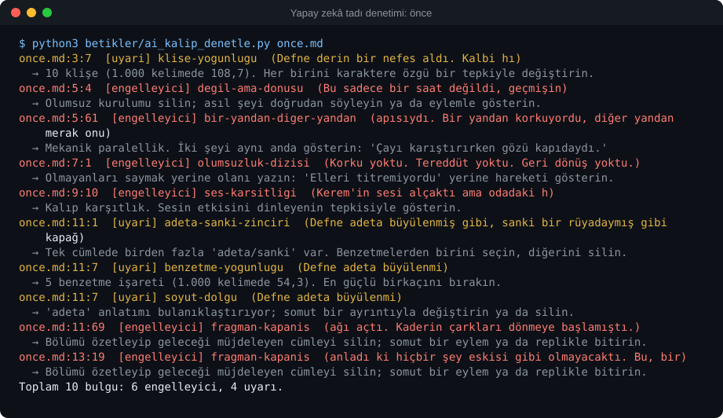
</p>

Aynı denetim `sonra.md` üzerinde `Toplam 0 bulgu` verir ([çıktı](docs/gorseller/terminal-yz-tadi-sonra.svg)). Denetçi bir yazım denetleyicisidir, yapay zekâ dedektörü değildir: hedef okuma deneyimidir. Ayrıntı: [ornekler/yz-tadi-karsilastirma](ornekler/yz-tadi-karsilastirma/README.md).

### Örnek bölüm: *Saatçinin Kızı*, 1. Bölüm

Depodaki özgün örnek romandan (Kuzguncuk'ta geçen bir polisiye). Plan, takip dosyaları ve ikinci bölüm [ornekler/roman/saatcinin-kizi](ornekler/roman/saatcinin-kizi/) altında.

> Kepenk, kırk günlük tozu Defne'nin ayakkabılarına döktü. İki basamak inip kapıyı itti. İçerisi makine yağı, pirinç ve bayat çay kokuyordu. Dedesinin kokusu.
>
> Duvarda otuz iki saat vardı. Defne onları saymak zorunda değildi; çocukken her birine ad vermişti. Hepsi susuyordu. Akrepler üçün hemen ötesinde, yelkovanlar on dördüncü dakika çizgisinde bekliyordu.
>
> Hepsi.
>
> Tezgâhın arkasına geçti, dedesinin önlüğünü çividen almadı. Oraya dokunursa ağlayacağını biliyordu, ağlamaya vakti yoktu. Emlakçı öğleden sonra gelecekti.
>
> İlk olarak Kara Kuzu'yu kurdu, kapı üstündeki ceviz kasalı duvar saatini. Anahtarı yedi kez çevirdi, sarkacı parmağıyla itti. Saat öksürür gibi iki kez vurdu, sonra düzenli bir tık tak tutturdu. Defne sesini dinledi. Biraz aceleciydi, günde üç dakika ileri giderdi. Dedesi buna "gençlik heyecanı" derdi.
>
> Sonra Paşa'yı kurdu, sonra Tombul'u. Her saat başka bir sesle uyandı. Öğlene doğru dükkân yeniden konuşmaya başlamıştı ve Defne ilk kez burada yalnız olmadığını hissetti.
>
> Kapının zili çaldı.
>
> Gelen adam eşikte durdu, gözlerini ışığa alıştırmaya çalıştı. Uzun boylu, siyah saçlıydı. Montunun omuzları yağmurdan ıslanmıştı.
>
> — Açık mısınız?
>
> *[…] Bölümün devamı: [bolum-001_durmus-saatler.md](ornekler/roman/saatcinin-kizi/metin/bolum-001_durmus-saatler.md)*

### Editörün ilk okuması ve yayın dosyaları

<p align="center">
  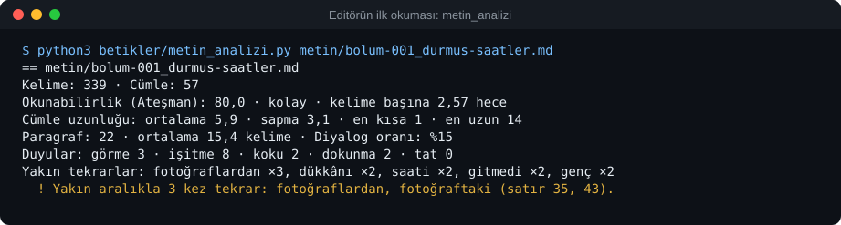
</p>

<p align="center">
  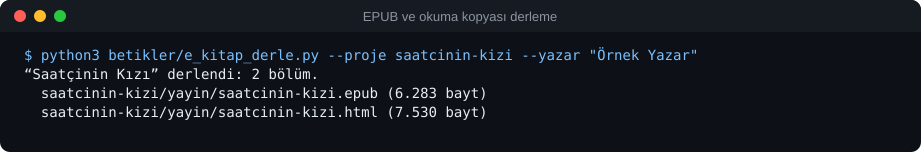
</p>

Her bölümün kaydı sonrasında `takip/baglam.md` bağlam kartı, ipucu tablosu, karakter durumları ve iki zaman çizelgesi (yazar gerçeği / okur bilgisi) tek bir JSON kaynaktan yeniden üretilir: [örnek takip klasörü](ornekler/roman/saatcinin-kizi/takip/).

## 🔄 İş akışı

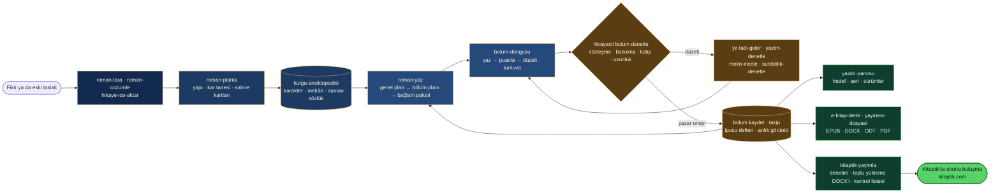

## 🧰 Beceriler

| Aşama | Beceri | Ne işe yarar | Kaynak |
|---|---|---|---|
| Başlangıç | `hikaye` | Giriş noktası ve yönlendirici; çoklu kitap, yazar hafızası, yerel çalışma masası | özgün |
| | `hikaye-kurulum` | Ajan, kanca, kural ve kaynakları 8 ev sahibine güvenle kurar | özgün |
| Tarama | `roman-tara` | Türkiye roman pazarı ve bölümlü yayın taraması; gerekçeli tür/konu önerisi | özgün |
| | `oyku-tara` | Öykü yayın yerleri (dergi, yarışma, seçki) ve eğilim taraması | özgün |
| Çözümleme | `roman-cozumle` | Romanı yapısal olarak çözümler; bölüm dizini, üslup profili, ilham kütüphanesi | özgün |
| | `oyku-cozumle` | Kısa öyküyü çekirdek, yapı, duygu yayı ve dönüm noktası açısından çözümler | özgün |
| Planlama | `roman-planla` | Yapı yöntemleri, kar tanesi, sahne kartları, mantar pano, plan denetimi, "nerede kaldım" ve özet katmanları | **yeni (2.0)** |
| | `kurgu-ansiklopedisi` | Karakter, mekân, nesne, grup, zaman çizelgesi, sözlük; tutarlılık, dağılım, ilişki grafiği, bağlam paketi, ipucu defteri, dönem denetimi | **yeni (2.0)** |
| Yazım | `roman-yaz` | Genel plan, cilt ve bölüm planı, bölüm bölüm yazım, günlük yazım, revizyon | özgün |
| | `bolum-dongusu` | Yazar onaylı yaz → eleştir → düzelt döngüsü, bölüm turnuvası (Elo), ses izi, anlık görüntü | **yeni (2.0)** |
| | `oyku-yaz` | 1.500–10.000 kelimelik öykü: duygu hedefi, sahne planı, yazım, son okuma | özgün |
| | `hikaye-ice-aktar` | DOCX, ODT, EPUB, TXT ve Markdown taslağını Türkçe bölüm başlıklarıyla bölerek projeye aktarır | özgün |
| Düzelti | `yz-tadi-gider` | Türkçe yapay zekâ kalıplarını satır satır bulur ve giderir | özgün |
| | `metin-incele` | Editör gözüyle 100 puanlık inceleme ve okur paneli | özgün |
| | `yazim-denetle` | TDK Yazım Kılavuzu'na göre yazım ve noktalama denetimi | **yeni** |
| | `sureklilik-denetle` | Ölü karakter, süresi geçen ipucu, gizli bilgi sızıntısı, ad kayması avı | **yeni** |
| Takip | `yazim-panosu` | Kitap ve günlük kelime hedefi, seri, bitiş tahmini, bölüm ilerlemesi, HTML pano | **yeni (2.0)** |
| Yayın | `e-kitap-derle` | EPUB 3, DOCX, ODT, A5 baskı HTML'i ve PDF, HTML okuma kopyası, TXT, Markdown; bitmemiş işaret kapısı | **yeni (1.1, 2.0'da genişledi)** |
| | `kitaptik-yayimla` | Kitaptik (kitaptik.com) yayın paketi: kategori ve etiket, sınır ve içerik denetimi, toplu yükleme DOCX'i, kitap bilgileri, karakter kartları, kontrol listesi | **yeni (2.1)** |
| | `yayinevi-dosyasi` | Yayınevi paketi: künye, örnek bölümler, sinopsis, üst yazı | **yeni** |
| | `wattpad-bolum-planla` | Bölüm uzunluğu, bölme, telefonda okunurluk, yayın takvimi ve tampon | **yeni** |
| | `sesli-kitap-hazirla` | Seslendirme metni, süre tahmini, telaffuz sözlüğü | **yeni** |
| | `uyarlama-sinopsis` | Dizi, film ve dijital platform için logline, sinopsis, tretman | **yeni** |
| | `kapak-tasarla` | Tür ve platforma göre kapak istemi, isteğe bağlı görsel üretim ve kırpma | özgün |
| Araç | `tarayici-cdp` | Otomatik erişimi engelleyen sayfaları yazarın kendi tarayıcısıyla okuma | özgün |

"özgün": oh-story-claudecode'daki karşılığından Türkçe için yeniden yazıldı. Doğal dil de tetikler: "roman yazalım" → `roman-yaz`, "bu çok yapay zekâ gibi" → `yz-tadi-gider`, "EPUB yap" → `e-kitap-derle`, "Kitaptik'te yayımla" → `kitaptik-yayimla`, "Defne şu an nerede?" → `proje-kasifi` ajanı, "kar tanesi yöntemiyle planlayalım" → `roman-planla`, "bu bölümü puanla" → `bolum-dongusu`, "bu ay kaç kelime yazdım?" → `yazim-panosu`.

<details>
<summary><b>İlk isteğiniz için üç hazır kalıp</b></summary>

1. **Yeni kitap:** "[tür/öncül] bir roman başlatmak istiyorum. Önce elimdeki malzemede kesinleşmiş olgularla açık kararları ayır. Yalnızca açılışı planla: ana çatışma, bakış açısı ve bilgi verme sınırları, ilk üç bölümdeki değişim ve benim onaylamam gereken kararlar. Metin yazma."
2. **Var olan taslak:** "Bu taslağı devam ettirilebilir bir projeye dönüştür. 1–[N]. bölümler tamam; [dosya] yarım bir bölüm. Özgün metne dokunma, yarım bölümü tamam sayma, çıkarımla bulduğun bilgileri onayıma sun. Henüz devam yazma."
3. **Beğenmediğim bir bölüm:** "Bu bölüm [bulanık/tekrarlı/fazla açıklayıcı] okunuyor. Hikâye olgularını, karakterlerin bildiklerini ve açıklanmamış bilgileri koruyarak sorunu adlandır; yalnızca bu parçanın düzeltme önerisini, önce/sonra karşılaştırmasını ve gerekçelerini ver."
</details>

## ⚙️ Nasıl çalışır?

1. **Dosya sistemi hafızadır.** Kitap klasöründe `kurgu/`, `plan/`, `metin/` ve `takip/` ayrı tutulur. `takip/_takip-durumu.json` tek yapılandırılmış kaynaktır; bağlam kartı, ipuçları, karakter durumları ve ikili zaman çizelgesi bu dosyadan üretilir. Türetilmiş görünümlerin elle değiştirilmesi `denetle` tarafından yakalanır.
2. **Sekiz uzman ajan:** hikaye-mimari, anlati-yazari, tutarlilik-denetcisi, karakter-tasarimcisi, hikaye-arastirmaci, proje-kasifi, bolum-cikarici ve salt okunur `bolum-hakemi` (revizyon döngüsünün hakemi).
3. **Kancalar kaliteyi korur, yalnızca biri engeller:** bölüm planı yoksa ya da önceki bölüm kaydedilmemişse metin yazımı durur. Diğerleri (oturum bağlamı, yazım sonrası tarama, sıkıştırma öncesi devir notu, oturum günlüğü) yalnızca uyarır.
4. **Kurgu ansiklopedisi ve bağlam paketi:** `kurgu/` altındaki kayıtlar tutarlılık denetiminin kaynağıdır; `kurgu_ansiklopedisi.py baglam` her bölüm için yalnızca o bölümde geçen kişileri, açık ipuçlarını ve son bölüm özetlerini bayt sınırı içinde toplar.
5. **Sürümler güvencedir:** her revizyon kabulünden önce anlık görüntü alınır; `anlik_goruntu.py fark` kelime düzeyinde karşılaştırır, geri yükleme önce mevcut hâli saklar.
6. **Kitaba özgü kurallar:** `kurgu/ton.md` üslubu, `.yz-beyaz-liste` bilinçli tercihleri, `.yasak-kaliplar` bu kitapta görmek istemediğiniz ifadeleri tutar.

Ayrıntılar: [docs/mimari.md](docs/mimari.md) · [docs/100-bolum-tutarlilik.md](docs/100-bolum-tutarlilik.md) · [docs/yz-tadi-giderme.md](docs/yz-tadi-giderme.md).

## 🆚 Karşılaştırma

### Tipik araç türleriyle

| Yetenek | Genel sohbet asistanı | Masaüstü yazım programı (manuskript, bibisco, novelWriter türü) | Yapay zekâ roman üreticisi (web/Electron) | **AI Hikaye & Roman Oluşturma 2.1** |
|---|---|---|---|---|
| Kitap nerede yaşar? | Sohbet geçmişinde | Program dosyasında | Uygulama veritabanında | **Düz Markdown dosyalarında** |
| Yapay zekâ ile yazım | ✓ | — | ✓ | ✓ (ajanınızın modeliyle) |
| Planlama yöntemleri ve sahne kartları | — | ✓ | ◐ | ✓ |
| Plan konumunu ölçen denetim | — | — | — | ✓ |
| Kurgu ansiklopedisi ve tutarlılık denetimi | — | ◐ | ◐ | ✓ |
| İpucu vadesi ve unutma uyarısı | — | — | ◐ | ✓ |
| Ölçülebilir puanlı, yazar onaylı revizyon döngüsü | — | — | ◐ | ✓ |
| Türkçe yazım kuralları ve Türkçe yapay zekâ kalıpları | — | — | — | ✓ |
| Türkiye yayın pazarı (yayınevi, dergi, sesli kitap, dizi) | — | — | — | ✓ |
| EPUB, DOCX, ODT, baskı PDF'i | — | ✓ | ◐ | ✓ |
| Türkçe okur platformuna yayın paketi (Kitaptik) | — | — | — | ✓ |
| Kurulacak ek bağımlılık | — | Program | Uygulama, çoğunlukla API anahtarı | **Yok** (Python standart kitaplığı) |

`◐`: bu türdeki araçların bir kısmında ya da sınırlı biçimde var. Dokuz açık kaynak projeyle satır satır karşılaştırma, lisansları ve her projeden neyin esinlendiği: **[docs/OZELLIK-KARSILASTIRMA.md](docs/OZELLIK-KARSILASTIRMA.md)**.

### Özgün projeyle

| | oh-story-claudecode 0.7.11 | AI Hikaye & Roman Oluşturma 2.1 |
|---|---|---|
| Dil ve pazar | Çince web romanı (Qidian, Fanqie) | Türkiye Türkçesi; yayınevi, dergi, bölümlü yayın, sesli kitap, dizi |
| Beceri / ajan | 13 / 7 | 25 / 8 (13 yeniden yazılmış + 12 yeni beceri) |
| Planlama | genel plan, bölüm planı | + beş yapı yöntemi, kar tanesi, sahne kartları, plan denetimi |
| Kurgu bilgisi | ayar dosyaları | + ansiklopedi, sözlük, zaman çizelgesi, tutarlılık ve dağılım, dönem denetimi |
| Revizyon | inceleme | + puanlı, yazar onaylı döngü, Elo turnuvası, ses izi, anlık görüntü ve fark |
| Yapay zekâ tadı denetimi | Çince kalıplar | Türkçe kalıplar, çeviri kalkları, konuşma çizgisi kuralları, kitaba özgü yasak listesi |
| Yazım denetimi | yok | TDK kurallarıyla `yazim-denetle` |
| Yayın | yok | EPUB 3 (EPUBCheck), DOCX, ODT, baskı HTML'i ve PDF, TXT, Markdown; Kitaptik yayın paketi |
| Bağımlılık | Node.js + Python | Yalnızca Python standart kitaplığı |

## 🛡️ Kalite güvencesi

- **Testler:** 239 pytest testi her gönderimde Ubuntu (Python 3.11, 3.12, 3.13, 3.14), macOS ve Windows üzerinde çalışır. Uçtan uca senaryo testi bir romanı kurulumdan planlamaya, iki bölümün kapılardan ve revizyon döngüsünden geçirilmesine, turnuvaya, süreklilik ve dönem denetimine, anlık görüntü farkına, bütün biçimlerde dışa aktarmaya, DOCX'in geri içe aktarılmasına ve çalışma masası sunucusuna kadar tek akışta yürütür.
- **Çıktı doğrulama:** EPUB'lar W3C EPUBCheck 5.1.0 ile hatasız; DOCX ve ODT dosyaları XML olarak ayrıştırılır ve LibreOffice ile başsız açılıp dönüştürülür; Kitaptik DOCX'i açık kaynak mammoth kitaplığıyla okunup bölüm başlıkları ve kelime sayıları raporla karşılaştırılır (CI'da Ubuntu işinde).
- **Sağlamlık:** 1.084 bozuk girdi denemesinde (boş, ikili, Windows-1254, BOM, bozuk JSON, bozuk DOCX/ODT/EPUB, DOCTYPE/ENTITY içeren XML, yol aşımı denemeleri, bozuk durum dosyaları) Python izi yok; bütün hata iletileri Türkçe. Ayrıntı için `HIKAYE_AYIKLA=1`.
- **Türkçe uyum:** `turkce_uyum_denetle.py` her gönderimde CJK karakteri, ASCII'leştirilmiş Türkçe, yaygın yazım yanlışları, bozuk kodlama ve düzyazıya sızan İngilizce için bütün depoyu tarar.
- **Beceri değerlendirmeleri:** `evals/` altında 28 vaka: her beceri için tetiklenme ve sonuç vakaları, ayrıca ilgisiz isteklerde tetiklenmeme vakaları. Çalıştırmak için (Claude hesabı gerekir):

```bash
claude plugin eval . --runs 1 --ablation none   # hızlı deneme
claude plugin eval .                             # 3 tekrar, eklentisiz karşılaştırmayla
```

## ❓ Sık sorulanlar

<details>
<summary><b>Yapay zekâ tespit araçları metni hâlâ yapay zekâ olarak işaretliyor.</b></summary>

`yz-tadi-gider` bir yazım denetleyicisidir; hedefi okuma deneyimidir, tespit aracını atlatmak değil. En güçlü düzeltme yazarın kendi sesidir: yazar hafızasına kalıcı tercihlerinizi kaydedin, `kurgu/ton.md` dosyasını doldurun.
</details>

<details>
<summary><b>Yarım bir romanım var, devam edebilir miyim?</b></summary>

Evet: `/hikaye-kurulum`, yeni oturum, `/hikaye-ice-aktar`, çıkarımları onaylayın, sonra `/roman-yaz`. Word (DOCX), LibreOffice (ODT), EPUB, TXT ve Markdown dosyaları doğrudan bölümlere bölünür; önce `belge_ice_aktar.py onizle` ile bölüm sınırlarını görürsünüz.
</details>

<details>
<summary><b>Başka bir yazım programından geçiyorum. Neyi kaybederim?</b></summary>

Metninizi programınızdan DOCX ya da ODT olarak dışa aktarın ve içe aktarın; italik ve kalın korunur. Karakter, mekân ve zaman çizelgesi bilgilerini `kurgu_ansiklopedisi.py olustur` şablonlarına taşıyın; planlama yönteminiz (kar tanesi, üç perde, sahne kartları) burada da var. Yayına hazırlarken EPUB, DOCX, ODT ve baskı PDF'i aynı komutla çıkar.
</details>

<details>
<summary><b>Yapay zekâ bölümümü benden habersiz değiştirir mi?</b></summary>

Hayır. `bolum-dongusu` turları ayrı klasörde saklar; bir turu bölüm dosyasına yazmak için `--yazar-onayladi` şarttır ve önceki hâl her zaman anlık görüntüye alınır. `anlik_goruntu.py geri-yukle` ile istediğiniz sürüme dönersiniz.
</details>

<details>
<summary><b>Bölüm uzunlukları tutmuyor.</b></summary>

Her bölüm planında `Hedef uzunluk: 2.200 kelime` satırı zorunludur; ölçü tek ve makinedir (`gorunur_kelime_v1`). Kısa bölüm yeni olayla şişirilmez, uzun bölüme en çok bir sıkıştırma geçişi yapılır. Türkçe kelimeler uzun olduğu için basılı bir sayfa ortalama 230–280 kelimedir.
</details>

<details>
<summary><b>Hangi model en iyi Türkçe yazıyor?</b></summary>

Paket modelden bağımsızdır; yazan model, kullandığınız ajanın modelidir. Denetçiler ve kapılar her modelde aynı çalışır. Türkçe düzyazıda güçlü, uzun bağlam penceresi olan bir model seçin ve `metin-incele` ile karşılaştırın.
</details>

<details>
<summary><b>Metnim bir yere gönderiliyor mu?</b></summary>

Hayır. Denetim betikleri yerelde çalışır ve ağa çıkmaz. Metin yalnızca kullandığınız ajanın kendi modeline, o ajanın koşullarıyla gider. Çalışma masası sunucusu yalnızca `127.0.0.1` üzerinden erişime izin verir.
</details>

<details>
<summary><b>Güncellemeden sonra ne yapmalıyım?</b></summary>

Eklentiyi güncelleyin (`claude plugin marketplace update …` ya da `npx skills add …` komutunu yeniden çalıştırın), sonra yazım projenizde `/hikaye-kurulum` komutunu yeniden çalıştırıp yeni oturum açın.
</details>

<details>
<summary><b>Kitabımı Kitaptik'e benim yerime yükler mi?</b></summary>

Hayır. `/kitaptik-yayimla` hesabınıza giriş yapmaz, şifre istemez, siteyle bağlantı kurmaz; dosyaları ve metinleri hazırlar. Kitaptik'te **Yeni Kitap** formunu doldurup **Toplu Yükle** ile DOCX'i verir, **Yayınla** düğmesine siz basarsınız. Adımlar: [docs/KITAPTIK-ILE-YAYIMLAMA.md](docs/KITAPTIK-ILE-YAYIMLAMA.md).
</details>

<details>
<summary><b>Windows'ta çalışır mı?</b></summary>

Evet; testler Windows üzerinde de çalışır. `python3` yoksa `py -3` kullanın. Klonladığınız depoda `.agents/skills` bağlantısı için `git config core.symlinks true` gerekir.
</details>

## 🗺️ Yol haritası

- [x] 20 beceri, 7 ajan, kanca çekirdeği, 8 ev sahibi (1.0)
- [x] EPUB derleyici, metin analizi, okur paneli, kitaba özgü yasak listesi, eklenti değerlendirmeleri (1.1)
- [x] Yapı yöntemleri, kar tanesi, sahne kartları; kurgu ansiklopedisi; ipucu defteri; özet katmanları (2.0)
- [x] Yazar onaylı revizyon döngüsü, bölüm turnuvası, ses izi, anlık görüntü ve fark, yazım panosu (2.0)
- [x] DOCX, ODT, baskı PDF'i; DOCX/ODT/EPUB içe aktarma; Osmanlı ve erken Cumhuriyet kartları, dönem denetimi (2.0)
- [x] Kitaptik'te yayımla: denetim, toplu yükleme DOCX'i, kitap bilgileri ve kontrol listesi (2.1)
- [ ] Karakter bazında ses izi: karakterlerin repliklerini birbirinden ayıran ölçüler
- [ ] Beta okur geri bildirimlerini toplayan HTML okuma kopyası (yerel, sunucusuz)
- [ ] Topluluk tür kartları: bilimkurgu alt türleri, köy romanı, 1980 sonrası kent romanı

Öneriniz mi var? [Tartışmalar](https://github.com/cumabozkurt/ai-hikaye-roman-olusturma/discussions) bölümünde paylaşın.

## 🤝 Katkı

Hata bildirimi, tür kartı, Türkçe yapay zekâ kalıbı ya da yeni beceri önerileri memnuniyetle karşılanır. Başlamadan önce [CONTRIBUTING.md](CONTRIBUTING.md) dosyasını okuyun. Kısaca:

```bash
python3 -m pip install pytest
python3 -m pytest                          # bütün testler
python3 betikler/statik_denetim.py         # beceri biçimi, bağlantılar, sürüm, eşitlik
python3 betikler/turkce_uyum_denetle.py    # CJK karakteri ve Türkçe karakter hataları
python3 betikler/paylasilanlari_esitle.py  # paylasilan/ değişince kopyaları güncelle
python3 betikler/eklenti_dosyalari_uret.py # eklenti/pazar yeri bildirimlerini üret
```

İnceleme raporları (birinci, ikinci ve üçüncü tur): [docs/INCELEME-RAPORU.md](docs/INCELEME-RAPORU.md).

## ⭐ Yıldız geçmişi

<a href="https://star-history.com/#cumabozkurt/ai-hikaye-roman-olusturma&Date">
  
</a>

## 🙏 Kaynak ve Teşekkür

Bu proje, [zenstory-ai/oh-story-claudecode](https://github.com/zenstory-ai/oh-story-claudecode) (MIT, v0.7.11) projesinin mimarisine ve iş akışlarına dayanır: beceri yapısı, takip durumu ve türetilmiş görünümler, kanca tasarımı, ajan rolleri ve ev sahibi uyarlamaları oradan gelir. Özgün projeyi geliştiren ve açık kaynak olarak paylaşan oh-story-claudecode katkıcılarına teşekkür ederiz.

1.1 sürümündeki bazı fikirler şu açık kaynak projelerin yaklaşımlarından esinlenerek, kod alınmadan ve Türkçe için yeniden tasarlanarak uygulandı: okur paneli ve okur simülasyonu ([haowjy/creative-writing-skills](https://github.com/haowjy/creative-writing-skills), [tchr-dev/autonovel](https://github.com/tchr-dev/autonovel)), bitmemiş metin işaretleri ve nesnel düzyazı ölçümleri ([mrskwiw/claude-novel-writer](https://github.com/mrskwiw/claude-novel-writer)), kitaba özgü yasak kalıp listesi ([MintoTsukino/claude-novel-workflow](https://github.com/MintoTsukino/claude-novel-workflow)), EPUB derleme ([howells/fiction](https://github.com/howells/fiction)), değerlendirme vakaları ([Claude Code plugin eval belgeleri](https://code.claude.com/docs/en/plugin-evals), [anthropics/skills](https://github.com/anthropics/skills)). Okunabilirlik formülü: Ateşman, E. (1997), "Türkçede okunabilirliğin ölçülmesi", *Dil Dergisi*, 58, 71–74.

### Esinlenilen Projeler

2.0 sürümü hazırlanırken aşağıdaki dokuz açık kaynak projenin özellikleri, iş akışları ve veri modelleri uçtan uca incelendi. Her biri roman yazımına kendi yolundan önemli bir katkı sunuyor; emekleri için geliştiricilerine teşekkür ederiz. Bu projelerden **hiçbir kod, istem, metin ya da görsel alınmadı**; yalnızca fikirler Türkçe yazım pratiğine göre bağımsız olarak yeniden tasarlandı. Ayrıntılı karşılaştırma: [docs/OZELLIK-KARSILASTIRMA.md](docs/OZELLIK-KARSILASTIRMA.md).

| Proje | Lisans | Esinlendiğimiz fikir |
|---|---|---|
| [PenglongHuang/chinese-novelist-skill](https://github.com/PenglongHuang/chinese-novelist-skill) | MIT | Katmanlı soru-cevapla fikir toplama, sürdürülebilir yazım planı, doğrulama turları |
| [saga-soft/novelWriter](https://github.com/saga-soft/novelWriter) · [vkbo/novelWriter](https://github.com/vkbo/novelWriter) | GPL-3.0 | Düz metin proje yapısı, oturum istatistikleri, çok biçimli derleme |
| [ExplosiveCoderflome/AI-Novel-Writing-Assistant](https://github.com/ExplosiveCoderflome/AI-Novel-Writing-Assistant) | AGPL-3.0 | Bölümdeki kişilere göre süzülen bağlam, olgu ve ipucu geri yazımı |
| [olivierkes/manuskript](https://github.com/olivierkes/manuskript) | GPL-3.0 | Kar tanesi yöntemi, dizin kartları, karakter motivasyon alanları |
| [NousResearch/autonovel](https://github.com/NousResearch/autonovel) | lisans belirtilmemiş | Puanlı revizyon döngüsü, Elo turnuvası, ses izi, ipucu defteri |
| [RhythmicWave/NovelForge](https://github.com/RhythmicWave/NovelForge) | AGPL-3.0 | Şemalı kayıt kartları, bilgi grafiği, kelime sayısı denetimi |
| [EthanYoQ/AI-Novel-Writer](https://github.com/EthanYoQ/AI-Novel-Writer) | GPL-3.0 | Kaynağı belli süreklilik bulguları, birleştirmeden önce fark, EPUB içe aktarma |
| [andreafeccomandi/bibisco](https://github.com/andreafeccomandi/bibisco) | GPL-3.0 | Karakter mülakatı, mekân/nesne/grup kayıtları, bölümlere dağılım analizi |
| [heider-x/vela](https://github.com/heider-x/vela) | GPL-3.0 | Yapı şablonları, yeniden yaz → cilala → incele zinciri, yerel bilgi tabanı |

Türkçe sürümde bütün metinler, istemler, tür kartları, denetçiler, görseller ve örnekler yeniden yazılmıştır. Özgün depodaki Çince örnek metinler, çözümlenen üçüncü taraf eserlerden alıntılar ve kapak görselleri telif nedeniyle bu depoya alınmamıştır. Afiş ve terminal görselleri bu depo için özgün olarak üretilmiştir.

## 📄 Lisans

[MIT](LICENSE). Telif hakkı © 2025-2026 oh-story-claudecode · © 2026 Cuma Bozkurt.
