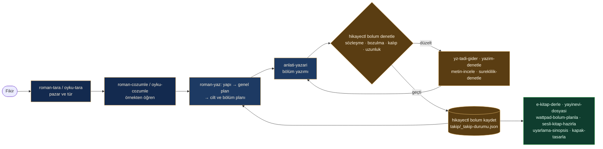

<p align="center">
  
</p>

<p align="center">
  <a href="#-hızlı-başlangıç"><b>Hızlı başlangıç</b></a>
  &nbsp;·&nbsp;
  <a href="#-kurulum"><b>Kurulum</b></a>
  &nbsp;·&nbsp;
  <a href="#-ne-üretir"><b>Ne üretir?</b></a>
  &nbsp;·&nbsp;
  <a href="#-beceriler"><b>Beceriler</b></a>
  &nbsp;·&nbsp;
  <a href="#-sık-sorulanlar"><b>SSS</b></a>
  &nbsp;·&nbsp;
  <a href="CHANGELOG.md"><b>Değişiklikler</b></a>
</p>

<p align="center">
  <a href="https://github.com/cumabozkurt/ai-hikaye-roman-olusturma/actions/workflows/test.yml"></a>
  <a href="https://github.com/cumabozkurt/ai-hikaye-roman-olusturma/releases/latest"></a>
  
  
  
  <a href="LICENSE"></a>
  
  <a href="https://github.com/cumabozkurt/ai-hikaye-roman-olusturma/stargazers"></a>
</p>

<p align="center">
  <a href="https://github.com/cumabozkurt/ai-hikaye-roman-olusturma/discussions"></a>
</p>

**AI Hikaye & Roman Oluşturma**, Claude Code, OpenAI Codex, OpenCode ve SKILL.md okuyabilen her kodlama ajanının içine kurulan **Türkçe bir yazım atölyesidir**. Pazar taramasından çözümlemeye, bölüm bölüm yazımdan 100+ bölümlük süreklilik takibine, TDK yazım denetiminden yapay zekâ tadı gidermeye, kapaktan EPUB'a ve yayınevi dosyasına kadar bütün yolu 20 beceri, 7 uzman ajan ve belirlenimci Python denetçileriyle yürütür. Kitabınız sohbet hafızasında değil, dosyalarınızda yaşar; ek model, GPU ya da bulut hesabı gerekmez.

> Bu depo, [oh-story-claudecode](https://github.com/zenstory-ai/oh-story-claudecode) projesinin Türkiye Türkçesine ve Türkiye yayın dünyasına göre **baştan yazılmış** hâlidir. Çeviri değil, yerelleştirmedir: tür kartları, platformlar, yazım kuralları, örnek metinler ve denetçiler Türkçe için yeniden kuruldu; yedi yeni beceri eklendi.

## ✨ Öne çıkanlar

| | | |
|---|---|---|
| **📚 Dosya sistemi hafızadır**<br>Kurgu, plan, metin ve takip ayrı dosyalarda. Bağlam sıkışsa da ipuçları, ölüler ve sırlar kaybolmaz. | **🚦 Kapılar ve denetçiler**<br>Plan yoksa bölüm yazılmaz. Her yazımdan sonra bozulma, yapay zekâ kalıbı, uzunluk ve plan kopyası taranır. | **🇹🇷 Türkiye'ye göre**<br>TDK yazımı, Türkçe yapay zekâ klişeleri, konuşma çizgisi, yayınevi ve dergi pratikleri, sesli kitap ve dizi uyarlaması. |
| **🔎 Editörün ilk okuması**<br>Ateşman okunabilirlik puanı, cümle ritmi, diyalog oranı, yakın tekrarlar, duyu dengesi. | **🧵 100+ bölüm süreklilik**<br>Yazar gerçeği / okur bilgisi ikili zaman çizelgesi, ölü karakter ve gizli bilgi sızıntısı avı. | **📦 Yayına hazır çıktı**<br>EPUB 3 (EPUBCheck hatasız), HTML okuma kopyası, yayınevi paketi, Wattpad takvimi, seslendirme metni. |

> **Wattpad notu:** Wattpad, Türkiye'de 12 Temmuz 2024'ten beri mahkeme kararıyla erişime kapalıdır (Eylül 2026 itibarıyla engel sürüyor). `wattpad-bolum-planla` ve `roman-tara` bu durumu bilir; ölçüler bütün bölümlü yayın platformlarında geçerlidir ve paket erişim engelini aşma yöntemi önermez.

## 🚀 Hızlı başlangıç

**1. Kurun** (Claude Code örneği; diğer ajanlar için [Kurulum](#-kurulum)):

```text
/plugin marketplace add cumabozkurt/ai-hikaye-roman-olusturma
/plugin install ai-hikaye-roman-olusturma@ai-hikaye-roman-olusturma
```

**2. Yazım klasörünüzü hazırlayın.** Boş bir klasörde ajanı açın ve şunu yazın, sonra **yeni bir oturum** başlatın:

```text
/hikaye-kurulum
```

**3. İlk isteğinizi yazın:**

```text
Kuzguncuk'ta geçen, amatör dedektifli bir polisiye roman başlatmak istiyorum.
Önce yapıyı tartışalım: okur sözleşmesi, ana merak sorusu, ilk üç bölümde ne değişecek. Metin yazma.
```

Gerisini `hikaye` yönlendiricisi halleder: yapı tartışması → genel plan → bölüm planı → yazım → denetim → takip kaydı.

## 📥 Kurulum

Python 3.11 ya da üstü gerekir (denetim betikleri ve kancalar yalnızca standart kütüphaneyi kullanır).

<details open>
<summary><b>Claude Code</b> (eklenti pazar yeri)</summary>

Claude Code içinde:

```text
/plugin marketplace add cumabozkurt/ai-hikaye-roman-olusturma
/plugin install ai-hikaye-roman-olusturma@ai-hikaye-roman-olusturma
```

ya da terminalden:

```bash
claude plugin marketplace add cumabozkurt/ai-hikaye-roman-olusturma
claude plugin install ai-hikaye-roman-olusturma@ai-hikaye-roman-olusturma
```

Eklentiyle kurulan beceriler ad alanıyla da çağrılabilir: `/ai-hikaye-roman-olusturma:roman-yaz`. Güncellemek için `claude plugin marketplace update ai-hikaye-roman-olusturma`.
</details>

<details>
<summary><b>OpenAI Codex</b></summary>

```bash
codex plugin marketplace add cumabozkurt/ai-hikaye-roman-olusturma
codex plugin add ai-hikaye-roman-olusturma@ai-hikaye-roman-olusturma
```

İkinci komut yerine Codex içindeki `/plugins` menüsünü de kullanabilirsiniz. Beceriler `$roman-yaz` ya da `/skills` ile çağrılır. Depoyu klonladıysanız `.agents/skills` bağlantısı sayesinde beceriler kendiliğinden bulunur.
</details>

<details>
<summary><b>Her ajan için tek komut</b> (npx skills)</summary>

```bash
npx skills add cumabozkurt/ai-hikaye-roman-olusturma -g -a claude-code codex opencode -y
```

`-g` kullanıcı düzeyinde kurar; yalnızca bulunduğunuz klasöre kurmak için kaldırın. `-a` ile ajanları seçin; `-a` vermezseniz araç bulduğu bütün ajanlara kurmayı dener ve genel kurulumu desteklemeyen ajanlar için zararsız "desteklemiyor" satırları yazar. Güncellemek için komutu yeniden çalıştırın.
</details>

<details>
<summary><b>OpenCode, Antigravity, ZCode, OpenClaw, Reasonix ve diğerleri</b></summary>

```bash
git clone https://github.com/cumabozkurt/ai-hikaye-roman-olusturma.git
cd ai-hikaye-roman-olusturma
bash betikler/kur.sh            # Claude Code, Codex ve OpenCode kullanıcı klasörlerine kopyalar
# Windows: powershell -ExecutionPolicy Bypass -File betikler\kur.ps1
```

ZCode için depo kökündeki `marketplace.json`, Reasonix için `reasonix-plugin.json` kullanılabilir.
</details>

**Kurulumu doğrulayın:** Claude Code'da `claude plugin details ai-hikaye-roman-olusturma@ai-hikaye-roman-olusturma`, OpenCode'da `opencode debug skill` 20 beceriyi listelemelidir. Sorun giderme ve ev sahibine göre ayrıntılar: [docs/ev-sahipleri.md](docs/ev-sahipleri.md).

**Yazım projesine kurulum (her proje için bir kez):** proje kökünde `/hikaye-kurulum` (Codex'te `$hikaye-kurulum`). Ajanları, kancaları, proje kurallarını ve ortak kaynakları güvenle kurar; kendi `CLAUDE.md`/`AGENTS.md` içeriğiniz korunur. Kurulumdan ve her sürüm yükseltmesinden sonra yeni bir oturum açın. Codex kancaları ilk kullanımda `/hooks` ile güven onayı ister.

## 👀 Ne üretir?

Aşağıdaki çıktıların hepsi depodaki örneklerden **gerçek komutlarla** üretildi (`python3 betikler/terminal_gorseli.py` ile yeniden üretilebilir).

### Yapay zekâ tadı: önce ve sonra

<table>
<tr><th width="50%">Önce: yapay zekâ tadı taşıyan sahne</th><th width="50%">Sonra: aynı sahne, eylem ve nesneyle</th></tr>
<tr><td valign="top">

> Defne derin bir nefes aldı. Kalbi hızla çarpıyordu ve içini bir ürperti kapladı.
>
> Bu sadece bir saat değildi, geçmişin kilitli bir kapısıydı. Bir yandan korkuyordu, diğer yandan merak onu kemiriyordu.
>
> Korku yoktu. Tereddüt yoktu. Geri dönüş yoktu.
>
> Kerem'in sesi alçaktı ama odadaki herkesi susturdu. Zaman durmuş gibiydi; sessizlik odayı doldurdu ve kelimelerle anlatılamaz bir gerilim havada asılı kaldı.
>
> Defne adeta büyülenmiş gibi, sanki bir rüyadaymış gibi kapağı açtı. Kaderin çarkları dönmeye başlamıştı.
>
> Ve o an anladı ki hiçbir şey eskisi gibi olmayacaktı. Bu, bir yolculuğun başlangıcıydı.

</td><td valign="top">

> Defne saati tezgâha bıraktı, parmaklarını önlüğüne sildi.
>
> Arka kapağın kenarında tırnak ucu kadar bir çentik vardı. Dedesi bu saati ona on iki yaşındayken bir kez göstermiş, sonra hiç sözünü etmemişti. Tornavidayı çentiğe yerleştirdi, eli bir an durdu.
>
> — Açacak mısın? dedi Kerem. Kapının eşiğinden ayrılmamıştı.
>
> Defne cevap vermedi. Çay ocağı fokurdadı, kimse kalkıp altını kısmadı.
>
> İkinci kapak tık diye kalktı. İçinde, katlanmış bir tren bileti duruyordu: Haydarpaşa–Ankara, 14 Mart 1987. Biletin arkasında dedesinin eğik yazısı: “Gelmedi.”
>
> Defne bileti ışığa tuttu. Mürekkep, son harfte dağılmıştı.

</td></tr>
</table>

<p align="center">
  
</p>

Aynı denetim `sonra.md` üzerinde `Toplam 0 bulgu` verir ([çıktı](docs/gorseller/terminal-yz-tadi-sonra.svg)). Denetçi bir yazım denetleyicisidir, yapay zekâ dedektörü değildir: hedef okuma deneyimidir. Ayrıntı: [ornekler/yz-tadi-karsilastirma](ornekler/yz-tadi-karsilastirma/README.md).

### Örnek bölüm: *Saatçinin Kızı*, 1. Bölüm

Depodaki özgün örnek romandan (Kuzguncuk'ta geçen bir polisiye). Plan, takip dosyaları ve ikinci bölüm [ornekler/roman/saatcinin-kizi](ornekler/roman/saatcinin-kizi/) altında.

> Kepenk, kırk günlük tozu Defne'nin ayakkabılarına döktü. İki basamak inip kapıyı itti. İçerisi makine yağı, pirinç ve bayat çay kokuyordu. Dedesinin kokusu.
>
> Duvarda otuz iki saat vardı. Defne onları saymak zorunda değildi; çocukken her birine ad vermişti. Hepsi susuyordu. Akrepler üçün hemen ötesinde, yelkovanlar on dördüncü dakika çizgisinde bekliyordu.
>
> Hepsi.
>
> Tezgâhın arkasına geçti, dedesinin önlüğünü çividen almadı. Oraya dokunursa ağlayacağını biliyordu, ağlamaya vakti yoktu. Emlakçı öğleden sonra gelecekti.
>
> İlk olarak Kara Kuzu'yu kurdu, kapı üstündeki ceviz kasalı duvar saatini. Anahtarı yedi kez çevirdi, sarkacı parmağıyla itti. Saat öksürür gibi iki kez vurdu, sonra düzenli bir tık tak tutturdu. Defne sesini dinledi. Biraz aceleciydi, günde üç dakika ileri giderdi. Dedesi buna "gençlik heyecanı" derdi.
>
> Sonra Paşa'yı kurdu, sonra Tombul'u. Her saat başka bir sesle uyandı. Öğlene doğru dükkân yeniden konuşmaya başlamıştı ve Defne ilk kez burada yalnız olmadığını hissetti.
>
> Kapının zili çaldı.
>
> Gelen adam eşikte durdu, gözlerini ışığa alıştırmaya çalıştı. Uzun boylu, siyah saçlıydı. Montunun omuzları yağmurdan ıslanmıştı.
>
> — Açık mısınız?
>
> *[…] Bölümün devamı: [bolum-001_durmus-saatler.md](ornekler/roman/saatcinin-kizi/metin/bolum-001_durmus-saatler.md)*

### Editörün ilk okuması ve EPUB

<p align="center">
  
</p>

<p align="center">
  
</p>

Her bölümün kaydı sonrasında `takip/baglam.md` bağlam kartı, ipucu tablosu, karakter durumları ve iki zaman çizelgesi (yazar gerçeği / okur bilgisi) tek bir JSON kaynaktan yeniden üretilir: [örnek takip klasörü](ornekler/roman/saatcinin-kizi/takip/).

## 🔄 İş akışı



## 🧰 Beceriler

| Aşama | Beceri | Ne işe yarar | Kaynak |
|---|---|---|---|
| Başlangıç | `hikaye` | Giriş noktası ve yönlendirici; çoklu kitap, yazar hafızası, yerel çalışma masası | özgün |
| | `hikaye-kurulum` | Ajan, kanca, kural ve kaynakları 8 ev sahibine güvenle kurar | özgün |
| Tarama | `roman-tara` | Türkiye roman pazarı ve bölümlü yayın taraması; gerekçeli tür/konu önerisi | özgün |
| | `oyku-tara` | Öykü yayın yerleri (dergi, yarışma, seçki) ve eğilim taraması | özgün |
| Çözümleme | `roman-cozumle` | Romanı yapısal olarak çözümler; bölüm dizini, üslup profili, ilham kütüphanesi | özgün |
| | `oyku-cozumle` | Kısa öyküyü çekirdek, yapı, duygu yayı ve dönüm noktası açısından çözümler | özgün |
| Yazım | `roman-yaz` | Genel plan, cilt ve bölüm planı, bölüm bölüm yazım, günlük yazım, revizyon | özgün |
| | `oyku-yaz` | 1.500–10.000 kelimelik öykü: duygu hedefi, sahne planı, yazım, son okuma | özgün |
| | `hikaye-ice-aktar` | Word/TXT/Markdown taslağı ya da yayımlanmış bölümleri projeye aktarır | özgün |
| Düzelti | `yz-tadi-gider` | Türkçe yapay zekâ kalıplarını satır satır bulur ve giderir | özgün |
| | `metin-incele` | Editör gözüyle 100 puanlık inceleme ve okur paneli | özgün |
| | `yazim-denetle` | TDK Yazım Kılavuzu'na göre yazım ve noktalama denetimi | **yeni** |
| | `sureklilik-denetle` | Ölü karakter, süresi geçen ipucu, gizli bilgi sızıntısı, ad kayması avı | **yeni** |
| Yayın | `e-kitap-derle` | EPUB 3 ve tek dosyalık HTML okuma kopyası; bitmemiş işaret kapısı | **yeni (1.1)** |
| | `yayinevi-dosyasi` | Yayınevi paketi: künye, örnek bölümler, sinopsis, üst yazı | **yeni** |
| | `wattpad-bolum-planla` | Bölüm uzunluğu, bölme, telefonda okunurluk, yayın takvimi ve tampon | **yeni** |
| | `sesli-kitap-hazirla` | Seslendirme metni, süre tahmini, telaffuz sözlüğü | **yeni** |
| | `uyarlama-sinopsis` | Dizi, film ve dijital platform için logline, sinopsis, tretman | **yeni** |
| | `kapak-tasarla` | Tür ve platforma göre kapak istemi, isteğe bağlı görsel üretim ve kırpma | özgün |
| Araç | `tarayici-cdp` | Otomatik erişimi engelleyen sayfaları yazarın kendi tarayıcısıyla okuma | özgün |

"özgün": oh-story-claudecode'daki karşılığından Türkçe için yeniden yazıldı. Doğal dil de tetikler: "roman yazalım" → `roman-yaz`, "bu çok yapay zekâ gibi" → `yz-tadi-gider`, "EPUB yap" → `e-kitap-derle`, "Defne şu an nerede?" → `proje-kasifi` ajanı.

<details>
<summary><b>İlk isteğiniz için üç hazır kalıp</b></summary>

1. **Yeni kitap:** "[tür/öncül] bir roman başlatmak istiyorum. Önce elimdeki malzemede kesinleşmiş olgularla açık kararları ayır. Yalnızca açılışı planla: ana çatışma, bakış açısı ve bilgi verme sınırları, ilk üç bölümdeki değişim ve benim onaylamam gereken kararlar. Metin yazma."
2. **Var olan taslak:** "Bu taslağı devam ettirilebilir bir projeye dönüştür. 1–[N]. bölümler tamam; [dosya] yarım bir bölüm. Özgün metne dokunma, yarım bölümü tamam sayma, çıkarımla bulduğun bilgileri onayıma sun. Henüz devam yazma."
3. **Beğenmediğim bir bölüm:** "Bu bölüm [bulanık/tekrarlı/fazla açıklayıcı] okunuyor. Hikâye olgularını, karakterlerin bildiklerini ve açıklanmamış bilgileri koruyarak sorunu adlandır; yalnızca bu parçanın düzeltme önerisini, önce/sonra karşılaştırmasını ve gerekçelerini ver."
</details>

## ⚙️ Nasıl çalışır?

1. **Dosya sistemi hafızadır.** Kitap klasöründe `kurgu/`, `plan/`, `metin/` ve `takip/` ayrı tutulur. `takip/_takip-durumu.json` tek yapılandırılmış kaynaktır; bağlam kartı, ipuçları, karakter durumları ve ikili zaman çizelgesi bu dosyadan üretilir. Türetilmiş görünümlerin elle değiştirilmesi `denetle` tarafından yakalanır.
2. **Yedi uzman ajan:** hikaye-mimari, anlati-yazari, tutarlilik-denetcisi, karakter-tasarimcisi, hikaye-arastirmaci, proje-kasifi ve bolum-cikarici.
3. **Kancalar kaliteyi korur, yalnızca biri engeller:** bölüm planı yoksa ya da önceki bölüm kaydedilmemişse metin yazımı durur. Diğerleri (oturum bağlamı, yazım sonrası tarama, sıkıştırma öncesi devir notu, oturum günlüğü) yalnızca uyarır.
4. **Kitaba özgü kurallar:** `kurgu/ton.md` üslubu, `.yz-beyaz-liste` bilinçli tercihleri, `.yasak-kaliplar` bu kitapta görmek istemediğiniz ifadeleri tutar.

Ayrıntılar: [docs/mimari.md](docs/mimari.md) · [docs/100-bolum-tutarlilik.md](docs/100-bolum-tutarlilik.md) · [docs/yz-tadi-giderme.md](docs/yz-tadi-giderme.md).

## 🆚 Özgün projeyle karşılaştırma

| | oh-story-claudecode 0.7.11 | AI Hikaye & Roman Oluşturma 1.1 |
|---|---|---|
| Dil ve pazar | Çince web romanı (Qidian, Fanqie) | Türkiye Türkçesi; yayınevi, dergi, bölümlü yayın, sesli kitap, dizi |
| Beceri sayısı | 13 | 20 (13 yeniden yazılmış + 7 yeni) |
| Yapay zekâ tadı denetimi | Çince kalıplar | Türkçe kalıplar, çeviri kalkları, konuşma çizgisi kuralları, kitaba özgü yasak listesi |
| Yazım denetimi | yok | TDK kurallarıyla `yazim-denetle` |
| Nesnel metin ölçümü | kelime/karakter sayısı | Ateşman okunabilirlik, cümle ritmi, diyalog oranı, yakın tekrar, duyu dengesi |
| E-kitap | yok | EPUB 3 + HTML okuma kopyası (EPUBCheck hatasız) |
| Değerlendirme | birim testleri | 140 pytest testi, 394 bozuk girdi denemesi, 23 vakalık `claude plugin eval` paketi |
| Bağımlılık | Node.js + Python | Yalnızca Python standart kütüphanesi |

## 🛡️ Kalite güvencesi

- **Testler:** Ubuntu (Python 3.11–3.14), macOS ve Windows üzerinde her gönderimde çalışır.
- **Sağlamlık:** 394 bozuk girdi denemesinde (boş, ikili, Windows-1254, BOM, bozuk JSON, klasör) Python izi yok; bütün hata iletileri Türkçe. Ayrıntı için `HIKAYE_AYIKLA=1`.
- **Türkçe uyum:** `turkce_uyum_denetle.py` her gönderimde CJK karakteri, ASCII'leştirilmiş Türkçe, yaygın yazım yanlışları, bozuk kodlama ve düzyazıya sızan İngilizce için bütün depoyu tarar.
- **Beceri değerlendirmeleri:** `evals/` altında her beceri için tetiklenme ve sonuç vakaları, ayrıca ilgisiz isteklerde tetiklenmeme vakaları. Çalıştırmak için (Claude hesabı gerekir):

```bash
claude plugin eval . --runs 1 --ablation none   # hızlı deneme
claude plugin eval .                             # 3 tekrar, eklentisiz karşılaştırmayla
```

## ❓ Sık sorulanlar

<details>
<summary><b>Yapay zekâ tespit araçları metni hâlâ yapay zekâ olarak işaretliyor.</b></summary>

`yz-tadi-gider` bir yazım denetleyicisidir; hedefi okuma deneyimidir, tespit aracını atlatmak değil. En güçlü düzeltme yazarın kendi sesidir: yazar hafızasına kalıcı tercihlerinizi kaydedin, `kurgu/ton.md` dosyasını doldurun.
</details>

<details>
<summary><b>Yarım bir romanım var, devam edebilir miyim?</b></summary>

Evet: `/hikaye-kurulum`, yeni oturum, `/hikaye-ice-aktar`, çıkarımları onaylayın, sonra `/roman-yaz`.
</details>

<details>
<summary><b>Bölüm uzunlukları tutmuyor.</b></summary>

Her bölüm planında `Hedef uzunluk: 2.200 kelime` satırı zorunludur; ölçü tek ve makinedir (`gorunur_kelime_v1`). Kısa bölüm yeni olayla şişirilmez, uzun bölüme en çok bir sıkıştırma geçişi yapılır. Türkçe kelimeler uzun olduğu için basılı bir sayfa ortalama 230–280 kelimedir.
</details>

<details>
<summary><b>Hangi model en iyi Türkçe yazıyor?</b></summary>

Paket modelden bağımsızdır; yazan model, kullandığınız ajanın modelidir. Denetçiler ve kapılar her modelde aynı çalışır. Türkçe düzyazıda güçlü, uzun bağlam penceresi olan bir model seçin ve `metin-incele` ile karşılaştırın.
</details>

<details>
<summary><b>Metnim bir yere gönderiliyor mu?</b></summary>

Hayır. Denetim betikleri yerelde çalışır ve ağa çıkmaz. Metin yalnızca kullandığınız ajanın kendi modeline, o ajanın koşullarıyla gider. Çalışma masası sunucusu yalnızca `127.0.0.1` üzerinden erişime izin verir.
</details>

<details>
<summary><b>Güncellemeden sonra ne yapmalıyım?</b></summary>

Eklentiyi güncelleyin (`claude plugin marketplace update …` ya da `npx skills add …` komutunu yeniden çalıştırın), sonra yazım projenizde `/hikaye-kurulum` komutunu yeniden çalıştırıp yeni oturum açın.
</details>

<details>
<summary><b>Windows'ta çalışır mı?</b></summary>

Evet; testler Windows üzerinde de çalışır. `python3` yoksa `py -3` kullanın. Klonladığınız depoda `.agents/skills` bağlantısı için `git config core.symlinks true` gerekir.
</details>

## 🗺️ Yol haritası

- [x] 20 beceri, 7 ajan, kanca çekirdeği, 8 ev sahibi (1.0)
- [x] EPUB derleyici, metin analizi, okur paneli, kitaba özgü yasak listesi, eklenti değerlendirmeleri (1.1)
- [ ] Bölüm sürüm anlık görüntüleri ve revizyon farkı raporu
- [ ] Karakter sesi parmak izi: karakterlerin repliklerini birbirinden ayıran ölçüler
- [ ] Beta okur geri bildirimlerini toplayan HTML okuma kopyası (yerel, sunucusuz)
- [ ] Bölüm turnuvası: aynı bölümün iki taslağını okur paneliyle karşılaştırma
- [ ] Topluluk tür kartları: bilimkurgu alt türleri, tarihî dönem kartları (Osmanlı, Cumhuriyet'in ilk yılları)

Öneriniz mi var? [Tartışmalar](https://github.com/cumabozkurt/ai-hikaye-roman-olusturma/discussions) bölümünde paylaşın.

## 🤝 Katkı

Hata bildirimi, tür kartı, Türkçe yapay zekâ kalıbı ya da yeni beceri önerileri memnuniyetle karşılanır. Başlamadan önce [CONTRIBUTING.md](CONTRIBUTING.md) dosyasını okuyun. Kısaca:

```bash
python3 -m pip install pytest
python3 -m pytest                          # bütün testler
python3 betikler/statik_denetim.py         # beceri biçimi, bağlantılar, sürüm, eşitlik
python3 betikler/turkce_uyum_denetle.py    # CJK karakteri ve Türkçe karakter hataları
python3 betikler/paylasilanlari_esitle.py  # paylasilan/ değişince kopyaları güncelle
python3 betikler/eklenti_dosyalari_uret.py # eklenti/pazar yeri bildirimlerini üret
```

İnceleme raporları (birinci ve ikinci tur): [docs/INCELEME-RAPORU.md](docs/INCELEME-RAPORU.md).

## ⭐ Yıldız geçmişi

<a href="https://star-history.com/#cumabozkurt/ai-hikaye-roman-olusturma&Date">
  
</a>

## 🙏 Kaynak ve Teşekkür

Bu proje, [zenstory-ai/oh-story-claudecode](https://github.com/zenstory-ai/oh-story-claudecode) (MIT, v0.7.11) projesinin mimarisine ve iş akışlarına dayanır: beceri yapısı, takip durumu ve türetilmiş görünümler, kanca tasarımı, ajan rolleri ve ev sahibi uyarlamaları oradan gelir. Özgün projeyi geliştiren ve açık kaynak olarak paylaşan oh-story-claudecode katkıcılarına teşekkür ederiz.

1.1 sürümündeki bazı fikirler şu açık kaynak projelerin yaklaşımlarından esinlenerek, kod alınmadan ve Türkçe için yeniden tasarlanarak uygulandı: okur paneli ve okur simülasyonu ([haowjy/creative-writing-skills](https://github.com/haowjy/creative-writing-skills), [tchr-dev/autonovel](https://github.com/tchr-dev/autonovel)), bitmemiş metin işaretleri ve nesnel düzyazı ölçümleri ([mrskwiw/claude-novel-writer](https://github.com/mrskwiw/claude-novel-writer)), kitaba özgü yasak kalıp listesi ([MintoTsukino/claude-novel-workflow](https://github.com/MintoTsukino/claude-novel-workflow)), EPUB derleme ([howells/fiction](https://github.com/howells/fiction)), değerlendirme vakaları ([Claude Code plugin eval belgeleri](https://code.claude.com/docs/en/plugin-evals), [anthropics/skills](https://github.com/anthropics/skills)). Okunabilirlik formülü: Ateşman, E. (1997), "Türkçede okunabilirliğin ölçülmesi", *Dil Dergisi*, 58, 71–74.

Türkçe sürümde bütün metinler, istemler, tür kartları, denetçiler, görseller ve örnekler yeniden yazılmıştır. Özgün depodaki Çince örnek metinler, çözümlenen üçüncü taraf eserlerden alıntılar ve kapak görselleri telif nedeniyle bu depoya alınmamıştır. Afiş ve terminal görselleri bu depo için özgün olarak üretilmiştir.

## 📄 Lisans

[MIT](LICENSE). Telif hakkı © 2025-2026 oh-story-claudecode · © 2026 Cuma Bozkurt.
